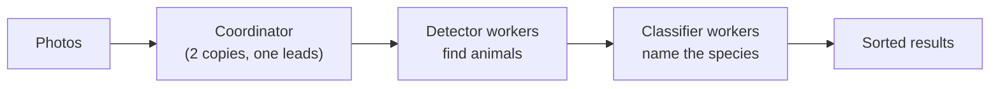

# Wildebeest

**Sorts wildlife camera-trap photos across many computers, and keeps going when one of them crashes.**


Camera traps take millions of photos, and most are empty (wind, grass, shadows). Wildebeest runs
two AI models on every photo: one throws out the empty ones, the other names the animal in the rest.
The interesting part is underneath. The scheduler that shares out the work, notices crashed machines
and guarantees no photo is lost or counted twice is written from scratch on plain Postgres and Redis,
with no job-queue library.

## Results

Measured on one Apple M2 laptop. "Before" is the first working version of the same project.

| | Before | After |
|---|---|---|
| Time to recover when a worker crashes | 5.6 s | **0.16 s** |
| Tasks the scheduler can hand out per second | ~240 | **~4,500** |
| Wait time for a task at the same load | 156 ms or more | **15 ms** |
| Photos lost or counted twice, over 30 injected failures | – | **0** |
| Real photos (1,000 through both AI models) | – | **9 min 40 s**, 0 failures |

How each number was measured: [benchmarks/ceiling/results.md](benchmarks/ceiling/results.md) and
[benchmarks/faults/results.md](benchmarks/faults/results.md).

## How it works



- **Work is handed out with leases.** A worker borrows a photo for a limited time. If it stops
  checking in, the photo goes to someone else.
- **Crashes are noticed instantly.** Docker tells the coordinator the moment a worker dies, so
  recovery takes a fraction of a second instead of waiting 6 s for missed check-ins.
- **Stale answers are rejected.** Every hand-out carries a version number (a *fencing token*).
  A frozen worker that wakes up late can't overwrite the answer of the worker that replaced it.
- **The coordinator can fail too.** Two copies run; if the leader dies, the other takes over in
  about 5 s, and the old leader is fenced out.
- **It scales and it's measured.** Adding workers adds throughput, slow workers get backup copies
  of their tasks, and a Mac GPU worker can join the CPU containers in the same pool.

## Try it

You need Docker Desktop (8 GB of memory or more) and [uv](https://docs.astral.sh/uv/) for Python.

```bash
make demo
```

This downloads 2,000 sample photos (about 1.2 GB) and starts everything. Then open
**http://localhost:8080** and press **Run a live demo**. While it runs, press **Crash a worker**
and watch the recovery happen step by step. The **Engineer** toggle at the top shows the full
technical view.

Optional extras:

```bash
make native-worker    # add a worker that runs on the Mac's GPU (macOS only)
make observability    # traces and metrics in Grafana at http://localhost:3300
make test             # unit tests
```

## Built with

Node.js and TypeScript (coordinator), Python (workers), PostgreSQL, Redis, MinIO, Docker Compose,
React (dashboard), PyTorch with Google's SpeciesNet and MegaDetector, OpenTelemetry and Grafana.

## Learn more

- [Technical details](docs/DETAILS.md): architecture, every speed and safety mechanism, the failure-mode table
- [Design decisions](docs/DECISIONS.md): what was chosen, why, and what it measured
- [Interfaces](docs/CONTRACTS.md): the API and data shapes between the parts
- [Per-phase write-ups](docs/decisions/): how each improvement was built and tested

## Credits

- Photos: [Snapshot Serengeti](https://lila.science/datasets/snapshot-serengeti), hosted by LILA BC,
  released under the [Community Data License Agreement (permissive, 1.0)](https://cdla.io/permissive-1-0/).
  The photos are downloaded by `scripts/download_sample.py` and are not stored in this repository.
  Please cite: Swanson AB, Kosmala M, Lintott CJ, Simpson RJ, Smith A, Packer C (2015).
  *Snapshot Serengeti, high-frequency annotated camera trap images of 40 mammalian species in an
  African savanna.* Scientific Data 2: 150026. https://doi.org/10.1038/sdata.2015.26
- Models: [SpeciesNet](https://github.com/google/cameratrapai) by Google, which includes
  [MegaDetector](https://github.com/agentmorris/MegaDetector).
