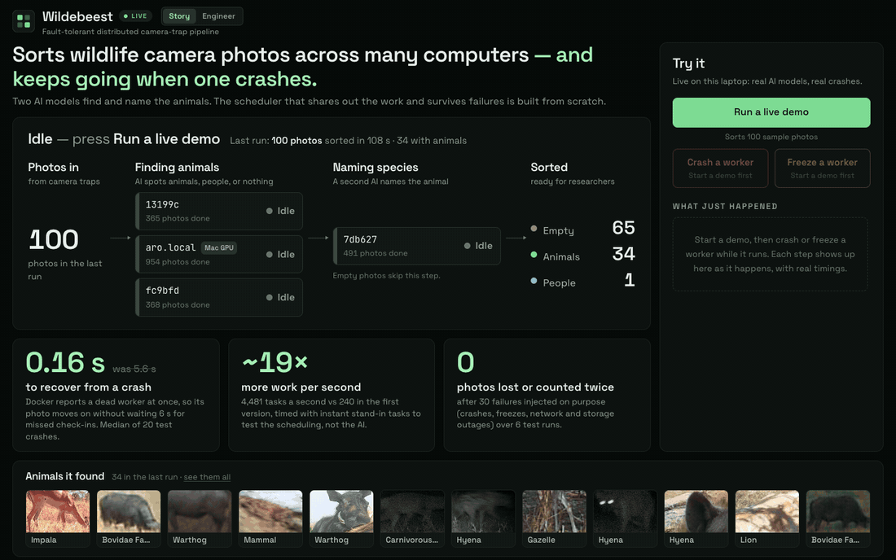
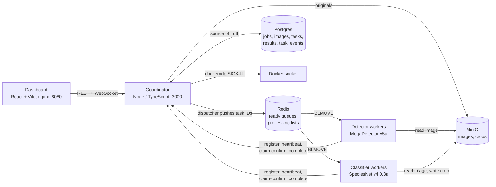
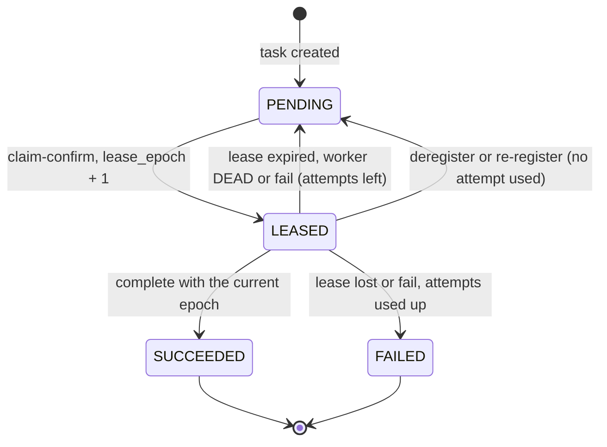
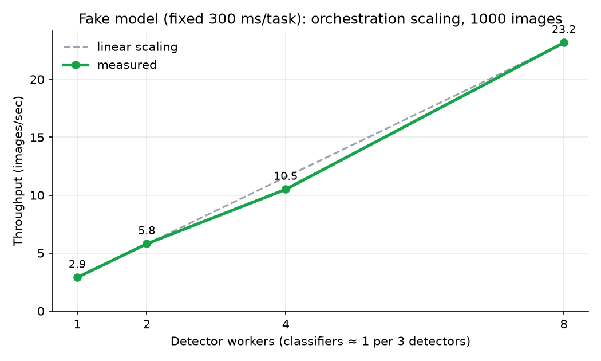

# ForgeGrid

A fault-tolerant distributed pipeline that sorts wildlife camera-trap photos into "empty" and "41 zebras, 12 lions, 8 elephants" across a pool of Docker workers, and keeps going when a worker dies halfway through.



## What it does

- **Filters out empty photos.** Camera traps fire on wind and grass, so most frames are empty. Stage 1 runs MegaDetector on every photo and finalises anything with no animal as `empty`, `human` or `vehicle`.
- **Identifies species.** Stage 2 runs Google's SpeciesNet classifier, with its ensemble and geofence for the job's country, on the top animal crop only, reusing the stage 1 boxes instead of detecting again.
- **Survives failures and scales out.** A Node/TypeScript coordinator hands out work with leases, heartbeats, fencing tokens and idempotent writes. You can SIGKILL a worker from the dashboard mid-job and the job still finishes with exactly one result per image. Each stage scales independently with `docker compose --scale`.

**Headline numbers**

| | |
|---|---|
| Orchestration throughput, 1 → 8 detector workers (fake 300 ms model) | 8.01× (linear) |
| Real-model throughput on one M2 laptop (CPU-bound, see [Results](#results)) | 1.34 img/s |
| Recovery after a worker SIGKILL (kill → all its tasks re-claimed) | 8.7 s (real models), 5.8 s (fake) |
| Rerun of a 1,000-image batch from the content-hash cache | 0.10 s |
| Photos filtered out as empty (300-image sample) | 71.7% |
| Empty-vs-animal accuracy (2,000 labelled Snapshot Serengeti images) | 92.1% (95.2% with the classifier's `blank` override, which the pipeline applies) |
| Top-1 species accuracy, 10 species | 86.0% |
| Animal recall (animal photos sent to stage 2) | 97.0% |

Accuracy figures come from the [Phase 1 baseline](docs/baseline.md).

## Quick start

```bash
make demo
```

Then open **http://localhost:8080** and click **Load sample dataset**.

`make demo` does three things:

1. Creates `.venv` with uv (Python 3.11) and installs the host-side script dependencies.
2. Downloads a 2,000-image Snapshot Serengeti sample (about 1.2 GB) into `data/sample/`, unless `data/sample/labels.csv` already exists.
3. Builds the images and starts the stack with 3 detectors and 1 classifier (`docker compose up -d --build --scale detector=3 --scale classifier=1`).

The first build downloads the SpeciesNet and MegaDetector weights into the worker image, so containers start without network access to Kaggle or GitHub. Expect the first build to take several minutes.

**Scaling.** Change the worker pools at any time, including mid-job:

```bash
docker compose up -d --scale detector=4 --scale classifier=2
```

New workers register and start pulling work as soon as their model has loaded (a few seconds). Removed workers get SIGTERM and exit gracefully (see [below](#graceful-sigterm-vs-sigkill)).

**Ports**

| Port | Service |
|---|---|
| 8080 | Dashboard (nginx; proxies `/api` and the WebSocket to the coordinator) |
| 3000 | Coordinator API |
| 9000 | MinIO S3 API (the browser loads presigned image URLs from it) |
| 9001 | MinIO console (`minioadmin` / `minioadmin`) |
| 15432 | Postgres (`forgegrid` / `forgegrid`) |
| 16379 | Redis |

Postgres and Redis publish on non-default host ports so they don't collide with local installs. Override them with `POSTGRES_HOST_PORT` and `REDIS_HOST_PORT`.

**Requirements**

- Docker with at least 8 GB of memory allocated. A detector peaks at about 1.3 GB at the default 640 px input and a classifier at about 1 GB, so 3 detectors and 2 classifiers fit in 8 GB. See [DECISIONS.md #31](docs/DECISIONS.md) for measured memory and capacity.
- About 5 GB of free disk. The worker image alone is 3.75 GB (CPU-only PyTorch plus the model weights).
- [uv](https://docs.astral.sh/uv/) and Python 3.11, for the dataset download script.

Other targets: `make down`, `make logs` (coordinator), `make clean` (also deletes volumes), `make benchmark`.

## Architecture



A job starts when the dashboard loads the sample or uploads photos. The coordinator hashes each photo, stores it in MinIO under `images/{sha256}.jpg`, and checks the content-hash cache: a photo whose detection (and, for animals, classification) is already stored for the current model versions is finalised on the spot. Every other photo gets a `PENDING` detect task in Postgres (or only a classify task, if its detection is cached but its classification is not). A 200 ms dispatcher loop moves task IDs from Postgres into the Redis ready queues. A detector worker pulls an ID with `BLMOVE`, confirms the claim over HTTP to get a lease, downloads the image, runs MegaDetector, and posts the boxes back. If any `animal` box has confidence ≥ 0.2, the coordinator creates a classify task; otherwise the photo is final as `human`, `vehicle` or `empty`. A classifier worker crops the top animal box, runs SpeciesNet with its ensemble and geofence, uploads the crop to `crops/{sha256}_{modelVersion}.jpg`, and posts the label. If the classifier says `blank`, the detector's box was a false positive and the photo is finalised as `empty`. Every task transition is recorded as a `task_event` and streamed to the dashboard over WebSocket, coalesced to at most one message per 100 ms per client.

Workers never touch Postgres, and the only Redis command they run is `BLMOVE`. Every task state change goes through the coordinator's HTTP API. The full payloads, Redis keys and object keys are in [docs/CONTRACTS.md](docs/CONTRACTS.md).

## How fault tolerance works

The design assumes workers die, stall and come back at the worst possible moment. Delivery is at-least-once, and every write is idempotent or fenced so that duplicates and late arrivals are harmless.

### Task state machine



Postgres is the source of truth. Every transition is a single guarded `UPDATE ... WHERE id = $1 AND state = '<expected>'`, plus `AND lease_epoch = $n` for anything a worker sends. If two actors race, one of them matches zero rows and loses cleanly. `MAX_ATTEMPTS` is 3; a task that runs out finalises its image as `failed`, and the job still completes. Source: [coordinator/src/tasks.ts](coordinator/src/tasks.ts).

### Reliable queue

- Workers claim with `BLMOVE queue:{stage} processing:{workerId} LEFT RIGHT 1`, which moves the ID atomically into a per-worker processing list. A task ID therefore never exists only in a worker's memory.
- The worker then calls `POST /tasks/claim-confirm`. The coordinator leases only tasks that are still `PENDING`, of the worker's stage, for a worker that is `ALIVE`, and `LREM`s the IDs from the processing list.
- If a worker dies between `BLMOVE` and claim-confirm, the reaper drains its processing list back to the ready queue (`LRANGE` + `DEL` in one `MULTI`).
- Duplicate IDs in a queue are harmless: the second copy finds the task no longer `PENDING` and is skipped.

Source: [worker/forgegrid_worker/runtime.py](worker/forgegrid_worker/runtime.py) (`claim_ids`), [coordinator/src/tasks.ts](coordinator/src/tasks.ts) (`claimConfirm`), [coordinator/src/workers.ts](coordinator/src/workers.ts) (`drainProcessingList`).

### Leases, heartbeats and the reaper

- A claim sets `lease_expires_at = now() + LEASE_MS` (15 s).
- Each worker's background thread sends a heartbeat every `HEARTBEAT_MS` (2 s). A heartbeat updates `last_heartbeat_at` and renews the leases of the task IDs the worker reports it still holds; a task it has dropped simply expires.
- The reaper runs every second. It marks a worker `DEAD` after `WORKER_TIMEOUT_MS` (6 s) of silence, then moves every `LEASED` task whose lease expired or whose worker is not `ALIVE` back to `PENDING` with `attempts + 1` (or to `FAILED`), drains dead workers' processing lists, and marks finished jobs done as a safety net.
- A dead worker that heartbeats again gets `410 WORKER_DEAD`. It drops its in-flight result and re-registers.

Each reassignment is written as a `reassigned` or `lease_expired` task event. The dashboard animates these events, and `/metrics` derives recovery time from them. Source: [coordinator/src/reaper.ts](coordinator/src/reaper.ts), [coordinator/src/workers.ts](coordinator/src/workers.ts) (`heartbeat`).

### Fencing tokens

Every claim increments the task's `lease_epoch` and returns it to the worker, and `complete` and `fail` must echo it. The scenario this handles:

1. Worker A claims task T and receives **epoch 3**.
2. A freezes, from a long GC pause or a network partition. Its heartbeats stop.
3. Six seconds later the reaper marks A `DEAD` and puts T back to `PENDING`.
4. Worker B claims T and receives **epoch 4**, then completes it. The result is stored.
5. A wakes up and posts its result with epoch 3. The guarded `UPDATE ... WHERE state = 'LEASED' AND lease_epoch = 3` matches nothing, so the coordinator answers **`409 STALE_LEASE`**, records a `stale_rejected` event, and discards A's result.

The check happens where the write happens: the coordinator is the only writer of task state and results, so a stale worker has no way around it. A stale worker's crop upload to MinIO is also harmless, because the key is deterministic and the crop is computed from the same stored detections. Source: [coordinator/src/tasks.ts](coordinator/src/tasks.ts) (`completeTask`, `rejectStale`).

### Idempotency

- Results are written with `INSERT ... ON CONFLICT (sha256, model_version) DO NOTHING` and then read back. The image is categorised from the row that was kept, not from the submitted one, so `images` and the result tables always agree.
- The stage 2 task is created with `ON CONFLICT (image_id, stage) DO NOTHING`, so a retried stage 1 completion can't enqueue classification twice.
- Object keys are content-addressed (`images/{sha256}.jpg`, `crops/{sha256}_{modelVersion}.jpg`). A retry overwrites identical bytes instead of creating a duplicate.
- An image is finalised with `WHERE final_category IS NULL`, and the job is marked done under a row lock on the job, so two "last" images finishing together can't leave the job running.

Source: [coordinator/src/results.ts](coordinator/src/results.ts).

### Content-hash cache

The cache key is `(sha256, model_version)` per stage, and the result tables themselves are the cache. At job creation, [coordinator/src/jobs.ts](coordinator/src/jobs.ts) (`createJob`) looks up every photo's hash. Fully cached photos are finalised in the same transaction as the job, so a fully cached job is already done when the API call returns. A cached detection without a cached classification skips only stage 1. The model version strings come from one Compose anchor that both the coordinator and the workers read, so changing a model, or the detector's input size, invalidates the cache on its own.

### Backpressure

Tasks are not pushed to Redis when they are created. The dispatcher ([coordinator/src/dispatcher.ts](coordinator/src/dispatcher.ts)) runs every 200 ms and:

- pushes recovered tasks (ones a worker had started before it died or lost its lease) to the *head* of their queue with `LPUSH`, so recovery doesn't wait behind a full queue;
- pushes every pending classify task. Stage 2 is never held back, because draining it is what relieves the pressure;
- tops `queue:detect` up to `DETECT_QUEUE_TARGET` (50), oldest first, using `FOR UPDATE SKIP LOCKED`, unless throttled;
- throttles stage 1 when `queue:classify` goes above `CLASSIFY_QUEUE_HIGH_WATER` (500), and releases only when it drops below `CLASSIFY_QUEUE_LOW_WATER` (200). The gap between the two thresholds stops the flag from flapping.

Throttle changes are logged, written as events, and shown on the dashboard.

Redis only holds derived state. If it loses its data, the dispatcher notices the missing `forgegrid:queues-built` sentinel on its next tick and rebuilds the ready queues from Postgres.

### Graceful SIGTERM vs SIGKILL

- **SIGTERM** (`docker compose stop`, or scaling down): the worker stops claiming, finishes its in-flight task, reports it, and calls `/workers/:id/deregister`. The coordinator marks it `STOPPED` and returns any unstarted leases to `PENDING` without using an attempt. Compose allows 12 s (`stop_grace_period`) before it escalates to SIGKILL.
- **SIGKILL** (the dashboard's Kill button and chaos mode, via dockerode): nothing runs on the worker. The heartbeats stop, the reaper declares it `DEAD` within about 6 s, and its tasks are reassigned. Chaos mode never kills the last live worker of a stage, because workers use `restart: "no"`.

Source: [worker/forgegrid_worker/runtime.py](worker/forgegrid_worker/runtime.py) (`_on_signal`, `run_once`), [coordinator/src/docker.ts](coordinator/src/docker.ts), [coordinator/src/chaos.ts](coordinator/src/chaos.ts).

## Results

Two sweeps, both with a cleared cache before each run ([benchmarks/results.md](benchmarks/results.md), [benchmarks/fake/results.md](benchmarks/fake/results.md)).

**Orchestration: fake model (fixed 300 ms per task, no CPU), 1000 images.** This isolates the coordinator, queues and leases from ML compute.

| Detectors | Classifiers | Wall time (s) | Throughput (img/s) | Speedup | p50 task time per image (ms) | p95 (ms) |
| --- | --- | --- | --- | --- | --- | --- |
| 1 | 1 | 346.5 | 2.89 | 1× | 338 | 683 |
| 2 | 1 | 172.5 | 5.8 | 2.01× | 335 | 676 |
| 4 | 1 | 95.2 | 10.5 | 3.63× | 330 | 667 |
| 8 | 3 | 43.2 | 23.16 | 8.01× | 322 | 662 |



**Real models (MegaDetector v5a @ 640 px + SpeciesNet) on one laptop, 300 images.** Apple M2, Docker Desktop VM with 8 vCPUs and 8 GB, 2 torch threads per worker.

| Detectors | Classifiers | Wall time (s) | Throughput (img/s) | Speedup | p50 task time per image (ms) | p95 (ms) |
| --- | --- | --- | --- | --- | --- | --- |
| 1 | 1 | 247.1 | 1.21 | 1× | 787 | 1936 |
| 2 | 1 | 224 | 1.34 | 1.11× | 1588 | 2817 |
| 3 | 1 | 225.8 | 1.33 | 1.1× | 2364 | 3978 |
| 4 | 1 | 230.7 | 1.3 | 1.07× | 3191 | 5250 |


**Where scaling flattens, and why.** The orchestration layer scales linearly: with a fake model, 8 detectors run 8.01× faster than 1 and per-task latency stays flat (~330 ms), so the coordinator, Redis and Postgres are not the bottleneck at this size. With real models, throughput is flat from the first worker: 1.21 img/s with 1 detector, 1.34 img/s at best, while each worker's per-image time grows in proportion to the worker count. The limit is the laptop, not the design. Running bare MegaDetector in 1, 2 and 4 containers side by side, with no pipeline at all, tops out at the same place:

| Bare MegaDetector processes (no ForgeGrid) | Per-image time | Aggregate |
| --- | --- | --- |
| 1 × 2 threads | 0.67 s | 1.49 img/s |
| 2 × 2 threads | 1.26–1.30 s | 1.56 img/s |
| 4 × 2 threads | 1.74–1.87 s | 1.65 img/s |
| 4 × 1 thread | 1.59–1.63 s | 1.86 img/s |

YOLOv5x6's large convolutions saturate the M2's shared CPU and memory bandwidth inside the VM (4 performance + 4 efficiency cores) at under two images per second, and the pipeline reaches about 80% of that ceiling. More throughput needs more machines or a GPU, which is exactly what the worker pool is for: workers only need Redis, MinIO and HTTP to the coordinator, so the same containers scale across hosts. Memory is the other limit: a real detector holds ~1.1 GB, so an 8 GB Docker VM fits about 4 detectors + 1 classifier.

Earlier runs on the same machine were 2–5× slower while macOS was swapping the Docker VM under memory pressure; the benchmark now records host free memory per run for that reason. CPU tuning that was measured and adopted or rejected is in [DECISIONS.md](docs/DECISIONS.md) (channels_last: −19% detector, −17% classifier; bf16, ONNX Runtime and Conv+BN fusion did not help).

Reproduce with `make benchmark` (real models; `BENCH_IMAGES`, `BENCH_DETECTORS` override the defaults of 300 images and 1–4 detectors, since the PRD's 6 and 8 real detectors need ~15 GB for Docker) and `make benchmark-fake` (fake model, 1–8 detectors). Each run cancels leftover jobs, clears the cache, measures recovery after a SIGKILL and a cached rerun, and writes `results.csv`, `results.md` and `throughput.png`.

### Phase 1 baseline (single process, no distribution)

SpeciesNet run in one process over the 2,000-image sample (1,400 empty, 600 animals across 10 species), natively on an Apple M2 CPU. Full report: [docs/baseline.md](docs/baseline.md).

| Metric | Value |
|---|---|
| Empty-vs-animal accuracy | 92.1% |
| ...counting the classifier's `blank` verdict as empty (the pipeline's behaviour) | 95.2% |
| Animal recall (animal images sent to stage 2) | 97.0% (582/600) |
| Animal precision | 80.6% (582/722) |
| Empty images correctly filtered | 90.0% (1,260/1,400) |
| Top-1 species accuracy (all animal images; missed counts as wrong) | 86.0% (516/600) |
| Top-1 species accuracy on images the detector found | 88.7% (516/582) |
| Single-process throughput | 0.73 images/s (1.37 s/image) |
| Median detector / classifier latency | 1,102 ms / 210 ms |

The baseline ran MegaDetector at its native 1280 px. The containers default to 640 px, which is about 2.5× faster on CPU and was as accurate on a 400-image check (93.8% vs 91.5% empty-vs-animal). See [DECISIONS.md #35](docs/DECISIONS.md).

## Testing

| Command | What it runs | What it proves |
|---|---|---|
| `make test-coordinator` | Vitest against real Postgres, Redis and MinIO. The tests call `dispatchOnce()` and `reapOnce()` directly and simulate time by back-dating heartbeats and leases. | The state machine: only `PENDING` tasks lease, exactly one of two concurrent claims wins, a wrong epoch gets `STALE_LEASE`, expired leases requeue with `attempts + 1`, `MAX_ATTEMPTS` leads to `FAILED`, heartbeats extend leases, dead workers' tasks and processing lists are recovered, deregister costs no attempt. Also idempotent result writes, cache hits and invalidation, dispatcher top-up and backpressure hysteresis, and the full stale-worker fencing scenario over HTTP. |
| `make test-worker` | pytest on the worker runtime, fake models and label mapping | Claims move IDs into the processing list, a 409 is discarded instead of raised, handler errors call `/fail` with the lease epoch, a 410 drops the in-flight result and re-registers, SIGTERM finishes the current task, skips the rest and deregisters. Also taxonomy-to-common-name mapping and crop keys. |
| `make test-integration` | The real Docker Compose stack with SpeciesNet. Takes several minutes on CPU. | **pipeline**: 2 detectors + 1 classifier finish a 200-image job, and every category matches its stored detections. **chaos**: 4 detectors + 2 classifiers, 300 images, 2 busy workers SIGKILLed mid-job. The job completes, every image has exactly one final result, no task is left `LEASED`, and a stale worker's late result gets `409` while the real result is kept. **cache-backpressure**: rerunning the same batch gives 100% cache hits in under 2 s, and 6 detectors + 1 classifier trigger the throttle (with the watermarks lowered to 20/5 so 300 images are enough). |

## Repository layout

```
├── docker-compose.yml     Postgres, Redis, MinIO, coordinator, detector, classifier, dashboard
├── Makefile               demo, up, down, test-*, benchmark
├── coordinator/           Node/TS: API, dispatcher, reaper, state machine, WebSocket, dockerode
│   ├── src/               tasks.ts, reaper.ts, dispatcher.ts, workers.ts, results.ts, jobs.ts, ...
│   ├── migrations/        001_init.sql
│   └── test/              Vitest suites
├── worker/                Python: shared runtime + detector/classifier handlers
│   ├── forgegrid_worker/  runtime.py, detector.py, classifier.py, labels.py, fake.py
│   └── tests/             pytest
├── dashboard/             React + Vite + Tailwind, served by nginx
├── scripts/               download_sample.py, baseline.py, benchmark.ts, plot_benchmark.py
├── tests/integration/     pipeline, chaos, cache-backpressure (Vitest, drives docker compose)
├── benchmarks/            baseline predictions, benchmark results and chart
└── docs/                  PRD, CONTRACTS, DECISIONS, baseline, INTERVIEW_NOTES
```

## Design decisions

Every choice where the spec was ambiguous, or where the build departed from it, is recorded in [docs/DECISIONS.md](docs/DECISIONS.md). Examples: why a dispatcher loop sits between Postgres and Redis, why the model version comes from the environment, and why the weights are baked into the image. Trade-offs, failure scenarios and what would change at 100× scale are in [docs/INTERVIEW_NOTES.md](docs/INTERVIEW_NOTES.md).

## Credits

- **Dataset:** [Snapshot Serengeti](https://lila.science/datasets/snapshot-serengeti), hosted by [LILA BC](https://lila.science/) (Labeled Information Library of Alexandria: Biology and Conservation). The sample uses season 1 and one frame per single-label sequence.
- **Models:** [SpeciesNet](https://github.com/google/cameratrapai) (`google/cameratrapai`, speciesnet 5.0.5, model v4.0.3a), which bundles [MegaDetector](https://github.com/agentmorris/MegaDetector) v5a as its detector.
