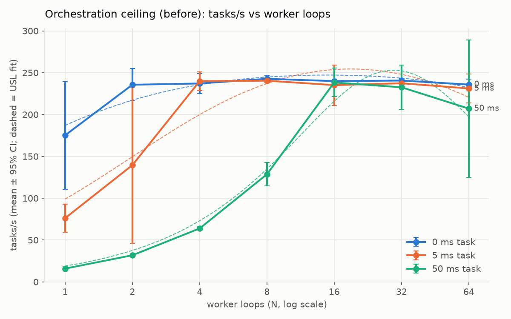
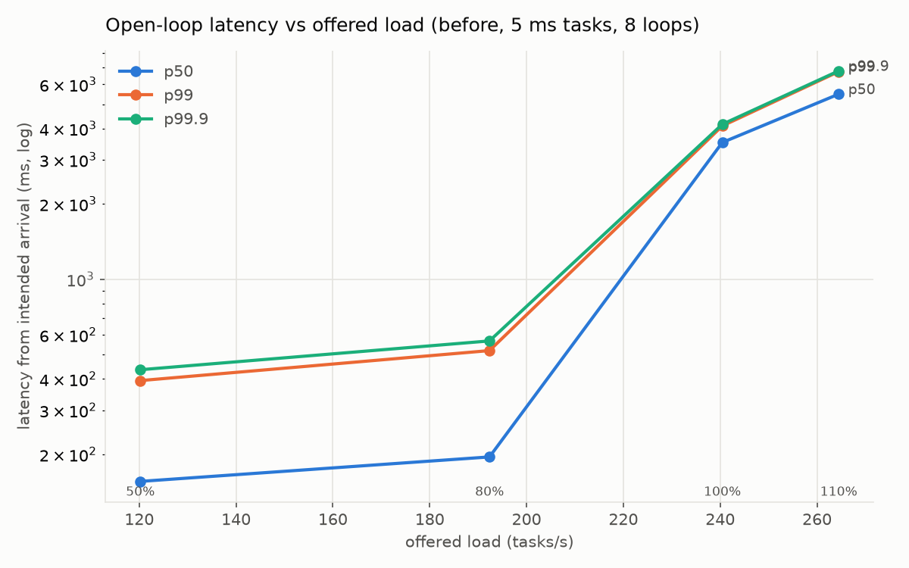
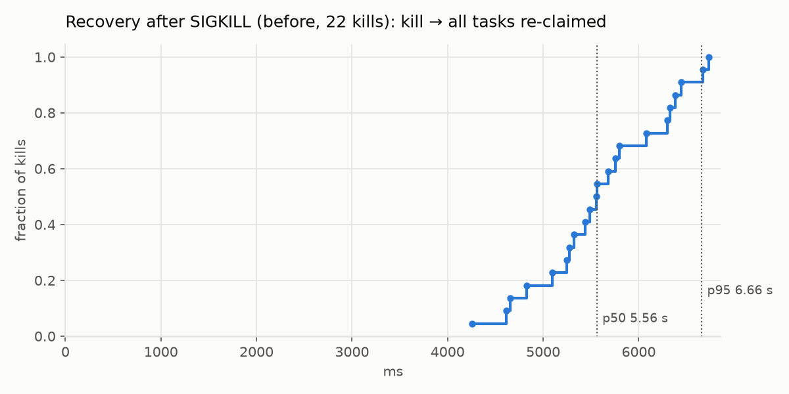

# Orchestration ceiling — before

Generated 2026-09-25T21:25:10Z on Apple M2, Docker Desktop 8 vCPU / 8 GB. Task source: **sample** mode, fake handler (sleep for the task time, return no detections so every task finalises one image). Throughput is the steady state between the 10th and 90th percentile completion; ± is the 95% t-interval over trials. Latency columns are lease time (claim-confirm → complete committed). The last column is the mean CPU of *other* projects' containers on the shared Docker VM during the point (100 = one core): the machine is shared, and a busy neighbour shows up here.

### 0 ms tasks

| Worker loops | Trials | Tasks/s | ± 95% CI | Lease p50 (ms) | Lease p99 (ms) | Cycle (ms) | Overhead/task (ms) | Little's law X·W/N | Other containers' CPU (%) |
|---|---|---|---|---|---|---|---|---|---|
| 1 | 3 | 175.2 | 64.3 | 1.83 | 11.91 | 5.80 | 5.80 | 1.000 | 127 |
| 2 | 3 | 235.6 | 19.4 | 1.97 | 10.06 | 8.50 | 8.50 | 1.000 | 77 |
| 4 | 3 | 237.1 | 11.9 | 3.02 | 15.59 | 16.88 | 16.88 | 1.000 | 77 |
| 8 | 3 | 242.7 | 4.3 | 3.99 | 15.74 | 33.00 | 33.00 | 1.001 | 57 |
| 16 | 3 | 240.0 | 2.6 | 4.73 | 27.12 | 66.85 | 66.85 | 1.003 | 45 |
| 32 | 3 | 240.6 | 2.7 | 16.11 | 58.18 | 133.33 | 133.33 | 1.002 | 52 |
| 64 | 3 | 235.8 | 6.3 | 33.32 | 137.49 | 268.10 | 268.10 | 0.988 | 46 |

### 5 ms tasks

| Worker loops | Trials | Tasks/s | ± 95% CI | Lease p50 (ms) | Lease p99 (ms) | Cycle (ms) | Overhead/task (ms) | Little's law X·W/N | Other containers' CPU (%) |
|---|---|---|---|---|---|---|---|---|---|
| 1 | 3 | 76.1 | 16.8 | 9.08 | 19.11 | 13.21 | 6.77 | 1.000 | 45 |
| 2 | 3 | 139.5 | 93.3 | 8.96 | 28.83 | 15.18 | 8.72 | 1.000 | 46 |
| 4 | 3 | 239.8 | 11.3 | 8.81 | 15.94 | 16.67 | 10.22 | 0.999 | 38 |
| 8 | 3 | 240.4 | 1.7 | 9.19 | 21.05 | 33.22 | 27.17 | 0.999 | 60 |
| 16 | 3 | 235.1 | 24.1 | 10.89 | 27.48 | 68.22 | 62.20 | 1.001 | 82 |
| 32 | 3 | 237.4 | 4.0 | 18.73 | 71.69 | 134.68 | 128.54 | 0.999 | 37 |
| 64 | 3 | 231.1 | 17.4 | 36.29 | 211.83 | 273.38 | 267.02 | 0.987 | 85 |

### 50 ms tasks

| Worker loops | Trials | Tasks/s | ± 95% CI | Lease p50 (ms) | Lease p99 (ms) | Cycle (ms) | Overhead/task (ms) | Little's law X·W/N | Other containers' CPU (%) |
|---|---|---|---|---|---|---|---|---|---|
| 1 | 3 | 15.9 | 2.3 | 56.24 | 69.73 | 63.21 | 11.08 | 1.000 | 44 |
| 2 | 3 | 31.8 | 1.6 | 55.68 | 69.57 | 62.84 | 10.72 | 1.000 | 69 |
| 4 | 3 | 63.8 | 2.1 | 55.47 | 68.61 | 62.64 | 10.70 | 1.000 | 41 |
| 8 | 3 | 128.6 | 14.1 | 54.52 | 71.68 | 62.23 | 10.78 | 0.999 | 43 |
| 16 | 3 | 238.3 | 17.0 | 54.36 | 73.37 | 67.09 | 15.93 | 0.999 | 49 |
| 32 | 3 | 232.5 | 26.5 | 61.22 | 121.06 | 137.81 | 86.33 | 1.000 | 71 |
| 64 | 3 | 207.0 | 82.2 | 77.63 | 506.72 | 309.21 | 257.23 | 0.981 | 96 |

### Universal Scalability Law fit

X(N) = λN / (1 + α(N−1) + βN(N−1)), least squares over every trial; CIs from 500 bootstrap resamples.

| Task (ms) | Points | λ (tasks/s per loop) | α (contention) | β (crosstalk) | R² | Peak N* | X(N*) |
|---|---|---|---|---|---|---|---|
| 0 | 7 | 187.0 [168.9, 201.0] | 0.7200 [0.6283, 0.7926] | 0.001270 [0.000908, 0.001610] | 0.733 | 14.9 | 247.2 |
| 5 | 7 | 98.9 [85.5, 109.1] | 0.3190 [0.2624, 0.3647] | 0.001888 [0.001632, 0.002186] | 0.856 | 19.0 | 254.4 |
| 50 | 7 | 19.0 [18.0, 20.5] | 0.0090 [0.0000, 0.0239] | 0.001142 [0.000842, 0.001452] | 0.964 | 29.5 | 253.0 |

### Per-task overhead

- One worker loop, cycle time minus the measured handler time (claim → work → complete → next claim; `time.sleep` overshoots by ~1.4 ms in these containers, so the handler's actual time is subtracted): **7.88 ms** ± 2.27 (all task times); by task time: 0 ms → 5.80 ± 2.28, 5 ms → 6.77 ± 3.40, 50 ms → 11.08 ± 7.17.
- Inside the lease (claim-confirm committed → complete committed, minus task time), p50: 2.86 ms.
- Worker-reported timings (tasks.timings, p50 of the last run): not recorded by this code.
- Little's law (X × mean cycle ÷ N, should be 1.0 in a closed loop): mean 0.998, range 0.967–1.004.

### Open loop (latency from intended arrival, no coordinated omission)

| Offered | Offered (tasks/s) | Achieved (tasks/s) | p50 (ms) | p90 (ms) | p99 (ms) | p99.9 (ms) | Max (ms) | Unfinished | Submit errors |
|---|---|---|---|---|---|---|---|---|---|
| 50% | 120.22 | 120.03 | 155.96 | 226.54 | 393.97 | 435.38 | 437.99 | 0 | 0 |
| 80% | 192.35 | 191.11 | 195.31 | 371.8 | 519.13 | 567.37 | 598.55 | 0 | 0 |
| 100% | 240.44 | 213.99 | 3516.8 | 4036.04 | 4094.66 | 4157.09 | 4167.23 | 0 | 0 |
| 110% | 264.48 | 209.66 | 5485.44 | 6605.87 | 6745.68 | 6791.65 | 6804.66 | 0 | 0 |

Where the median task spends its time (p50 of each hop, ms):

| Offered | intended arrival → image row committed | → claimed (dispatch + queue) | → completed (lease) |
|---|---|---|---|
| 50% | 6.58 | 136.5 | 10.1 |
| 80% | 6.58 | 173.31 | 10.85 |
| 100% | 8.62 | 3426.67 | 11.73 |
| 110% | 10.5 | 5459.28 | 10.67 |

### Recovery after SIGKILL

22 kills of busy fake-backend detector containers via `POST /workers/:id/kill` (2 more landed between tasks and are not counted). Detection via: heartbeat.

| | p50 (ms) | p95 (ms) | max (ms) |
|---|---|---|---|
| **kill → all tasks re-claimed** | **5,562** | **6,659** | **6,736** |
| kill → worker marked dead | 5,306 | 6,234 | 6,369 |
| kill → tasks requeued | 5,308 | 6,238 | 6,370 |
| requeued → re-claimed | 313 | 400 | 427 |

