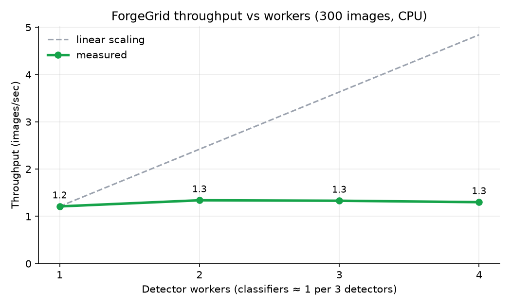

# Benchmark results

300-image Snapshot Serengeti sample, cache cleared before each run. Latency is per-image processing time (detect + classify task time), excluding queue wait.

| Detectors | Classifiers | Total (s) | Throughput (img/s) | Speedup | p50 (ms) | p95 (ms) | Peak detector RSS (MiB) | Peak classifier RSS (MiB) | Min host RAM free |
| --- | --- | --- | --- | --- | --- | --- | --- | --- | --- |
| 1 | 1 | 247.1 | 1.21 | 1× | 787 | 1936 | 1178 | 849 | 37% |
| 2 | 1 | 224 | 1.34 | 1.11× | 1588 | 2817 | 1162 | 851 | 57% |
| 3 | 1 | 225.8 | 1.33 | 1.1× | 2364 | 3978 | 1172 | 854 | 58% |
| 4 | 1 | 230.7 | 1.3 | 1.07× | 3191 | 5250 | 1129 | 840 | 59% |

- **Cache-hit rerun:** 300/300 images served from the content-hash cache in 0.08 s.
- **Recovery after SIGKILL:** 1 in-flight task(s) of a killed detector were reclaimed by live workers 8.7 s after the kill (bounded by WORKER_TIMEOUT_MS = 6 s plus the 1 s reaper tick).
