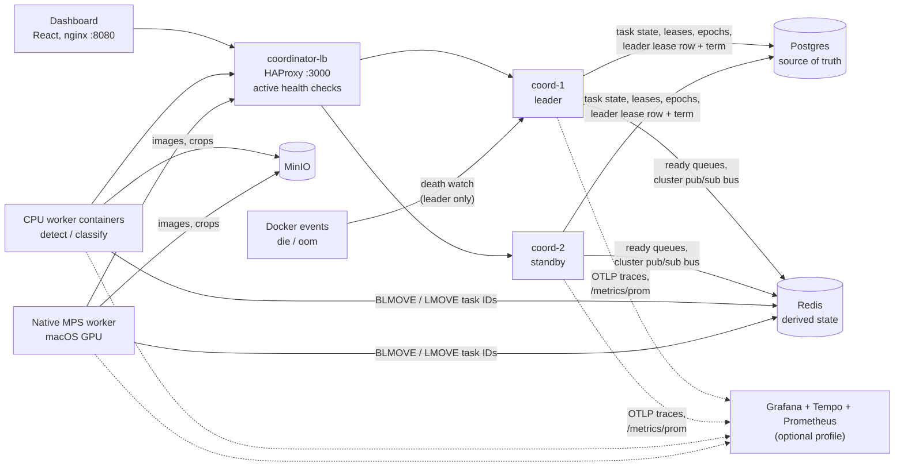
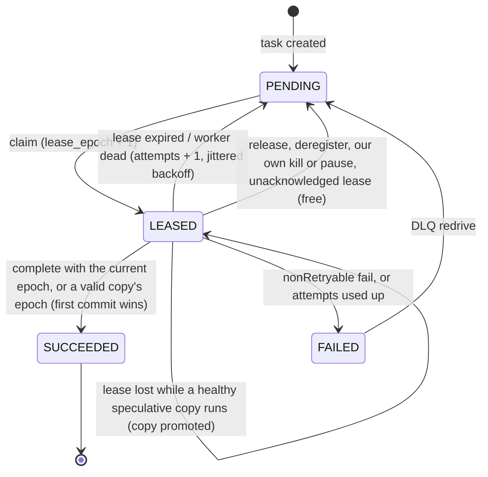
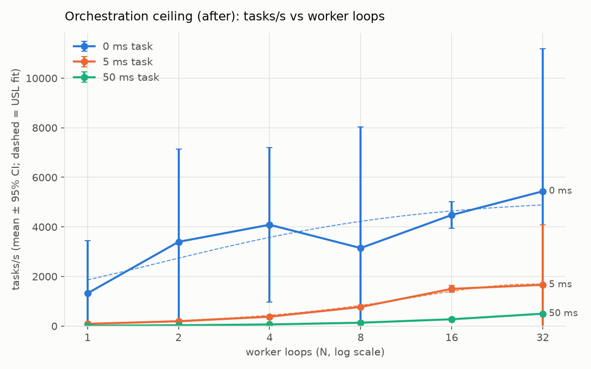
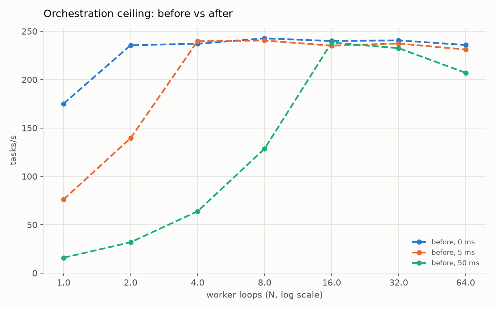
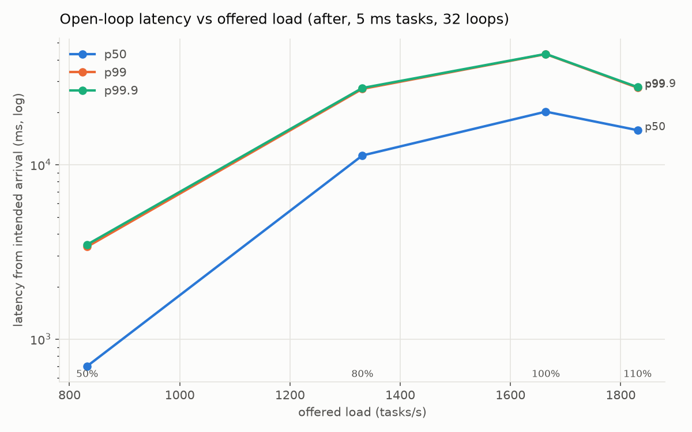
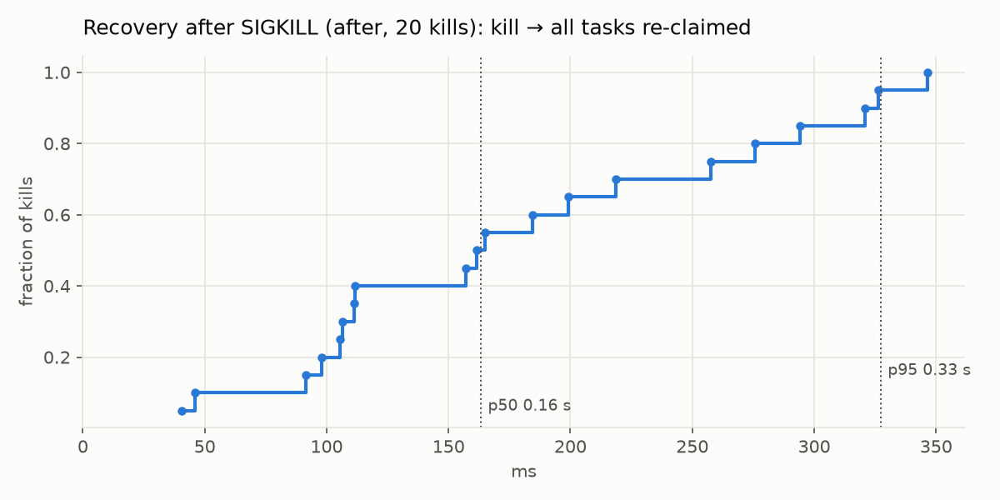
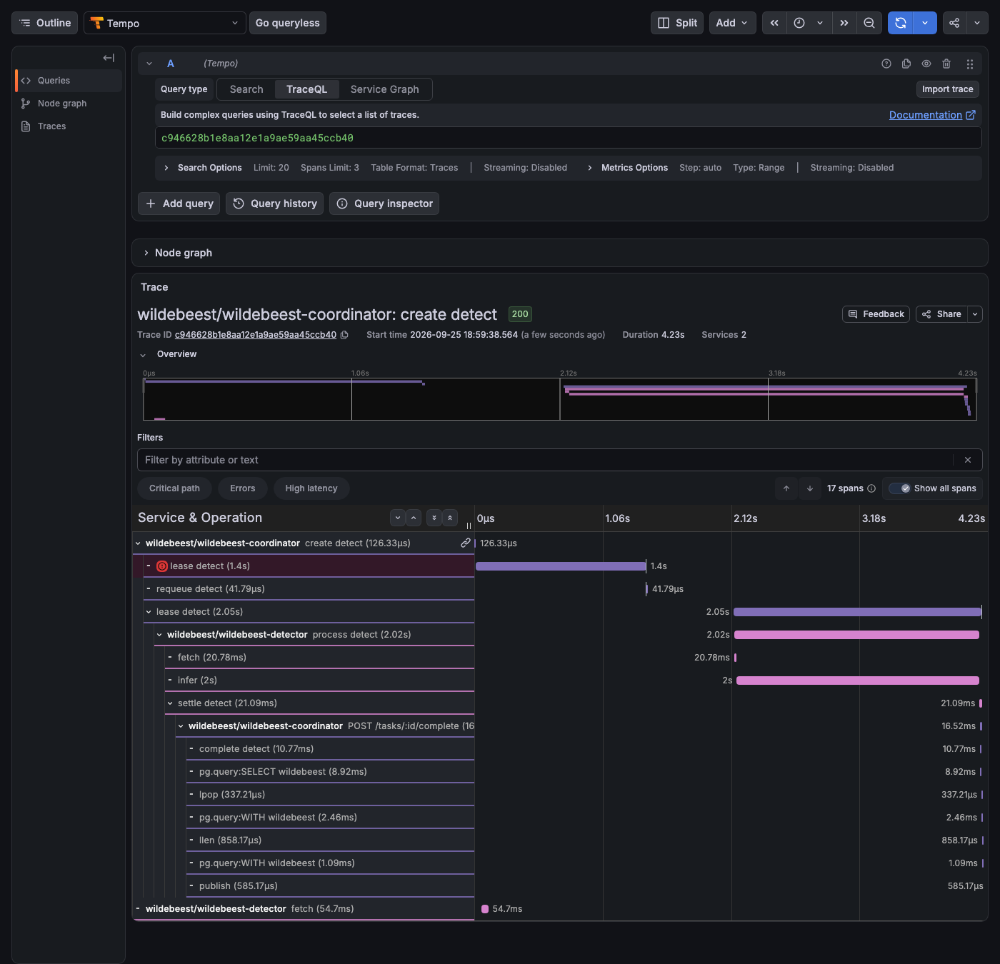

# Wildebeest: technical details

A fault-tolerant distributed task pipeline, built from leases, fencing tokens and Postgres, that sorts wildlife camera-trap photos across a heterogeneous worker pool and keeps its guarantees when workers, networks and coordinators fail mid-job.


The workload is real: MegaDetector drops the empty frames (about 72% of a Snapshot Serengeti sample) and Google's SpeciesNet names the species in the rest (86% top-1 on 10 species, [baseline](baseline.md)). The point of the project is the machinery underneath. The scheduler is written from scratch on plain Postgres and Redis: no job-queue library. It has a measured throughput ceiling, a recovery-time distribution, and an invariant checker run against a seeded fault matrix.

## Headline numbers

"Before" is the first complete version (single coordinator, 200 ms dispatcher tick, heartbeat-only failure detection). "After" is this branch. All numbers are from one Apple M2 laptop (Docker Desktop, 8 vCPU / 8 GB, shared with other workloads). Orchestration numbers use a fake model, so they measure the control plane rather than ML compute.

| | Before | After |
|---|---|---|
| Orchestration ceiling, 0 ms tasks (tasks/s) | ~240, flat from N = 2 (dispatcher refill cap) | **~4,500** at N = 16 worker loops |
| Per-task orchestration overhead, 1 worker loop | 7.9 ms | **4.8 ms** |
| Open-loop latency p50 at the same offered load (120–240 tasks/s, 8 loops, 5 ms tasks) | 156–3,517 ms | **15–17 ms** |
| Worker SIGKILL → all its tasks re-claimed, p50 / p95 | 5.6 s / 6.7 s (22 kills) | **163 / 327 ms** (20 kills) |
| Seeded fault matrix | 12 runs, 60 faults: 0 safety, 4 liveness violations (orphaned `BLMOVE`) | **6 runs, 30 faults, 0 violations** |
| Coordinator failover, leader SIGKILL | single coordinator: no failover | **5.3 s p50** (≈ the 5 s lease TTL); 0.18 s on graceful stop |
| Writes accepted from a deposed leader's stale term | n/a | **0 in 72 failover runs** (100 fenced attempts refused) |
| Job makespan with one 10× straggler | 28.8 s | **23.9 s** (−17%, speculative copies) |
| Real-model throughput, adding one native MPS worker to the CPU pool | 1× | **2.7–3.4×** |
| Full per-image tracing, cost on 0 ms tasks | n/a | 44% of throughput; **~5% at 10% head sampling** |

Details: [ceiling before/after](../benchmarks/ceiling/results.md), [fault matrix](../benchmarks/faults/results.md), [failover](decisions/h-ha.md#failover-test), [speculation](decisions/p3-speculation.md#measurements), [native worker](decisions/d-native.md#measurements), [tracing overhead](decisions/o-observability.md#overhead).

## Architecture



**Task lifecycle.** Creating a job hashes each photo, stores it in MinIO under its sha256, and checks the content-hash cache `(sha256, model_version)`. Every uncached photo gets a `PENDING` detect task, committed with `queued = false`; right after the commit the coordinator flips the flag and pushes the ID onto `queue:detect` in Redis. A worker moves IDs from the ready queue into its own `processing:{workerId}` list, then calls `claim-confirm`, which leases them in one SQL statement and returns a fencing epoch per task. The worker downloads the image (the next one prefetches while this one runs), runs MegaDetector, and reports the result together with a request for its next tasks. The coordinator applies the report in one PL/pgSQL call: a fenced `UPDATE`, an idempotent result insert, and then either finalising the image or creating a classify task. Classifier workers do the same with SpeciesNet on the top animal crop. Workers never touch Postgres. Every state change goes through the coordinator's HTTP API, which is where fencing is enforced. Payloads and keys are in [docs/CONTRACTS.md](CONTRACTS.md).

Two coordinator replicas serve the whole API behind HAProxy. One of them holds a lease on a Postgres row and runs the singleton work: the repair sweep, the reaper, the Docker death watch, speculation and chaos. Every leader-only transaction starts with a term check, so a replica that lost the lease cannot write.

## Why it's fast

The first version was capped at ~240 tasks/s at every worker count, because the dispatcher refilled `queue:detect` with 50 IDs per 200 ms tick. A task also cost about 17 Postgres round trips and 2 durable commits, and every image finalisation locked the job row. The changes below remove those limits one at a time. Measured effects come from [p2-hotpath.md](decisions/p2-hotpath.md) (3 trials per point, closed loop, fake tasks) unless another source is given.

| Change | Where | Measured effect |
|---|---|---|
| **Push after commit.** Whoever commits a transaction that makes tasks `PENDING` pushes them right after the commit. The task row is its own outbox (`queued = false` until a guarded flip), and the 200 ms tick is now only a repair sweep for pushes lost to a crash. No `LISTEN/NOTIFY`, which takes a global lock through commit. | [dispatcher.ts](../coordinator/src/dispatcher.ts) | Removes the refill cap: 240 → 1,328 tasks/s at 16 loops before any batching. Dispatch wait p50 2–3 ms → 0.6 ms. |
| **Detect queue sized to the pool**: `max(DETECT_QUEUE_MIN, 2 × Σ live workers' claim windows)`, refilled by a single-flight top-up on every claim. | [dispatcher.ts](../coordinator/src/dispatcher.ts) `detectQueueTarget` | Fast workers never drain the queue and wait for a tick. |
| **One-statement claim**: pick, guarded `UPDATE`, `claimed` events and lease details in one data-modifying CTE. | [tasks.ts](../coordinator/src/tasks.ts) `leaseSql` | 5 Postgres round trips → 1. |
| **One-statement complete**: `wb_complete()` does the fenced update, idempotent result insert and read-back, categorisation, finalisation or classify-task creation, and events. Validation stays in Node, before the statement. | [migrations/006, 007, 010](../coordinator/migrations) | ~12 round trips → 1. `completeMs` p50 1.2–11.5 ms → 1.0–1.7 ms. |
| **Complete-and-claim-next**: a report carries `next: k` and gets the worker's next leases back in the same request. | [api.ts](../coordinator/src/api.ts), [runtime.py](../worker/wildebeest_worker/runtime.py) | One coordinator round trip per batch instead of two per task. |
| **Batched completes with per-row fencing**: `POST /tasks/complete-batch` checks each row's epoch, so one stale row never fails the batch, and the accepted rows share one commit. | [tasks.ts](../coordinator/src/tasks.ts) | 872 / 1,740 / 5,886 tasks/s at 1 / 4 / 16 loops with 0 ms tasks: 3.8× / 7.3× / 24.5× over the tick dispatcher. |
| **Online claim-batch sizing**: k = ⌈RTT ÷ service time⌉ from EWMAs (RabbitMQ's prefetch rule). One `MULTI` of `LMOVE`s moves k IDs in one round trip. | [runtime.py](../worker/wildebeest_worker/runtime.py) `ClaimSizer` | k runs to the cap (16) for 0 ms tasks and stays at 1 for real models (~5 ms RTT against 300–1,100 ms inference), so batching never adds latency where it can't help. |
| **Prefetch**: the next leased image downloads and decodes on a background thread while the current one runs. | [storage.py](../worker/wildebeest_worker/storage.py) | `fetchMs` p50 0 ms on 400 real sample images. |
| **No hot job row**: an image finalisation counts the job's unfinalised images without a lock, and locks the job row only when a handful remain. The reaper's 1 s sweep catches the rare miss. | `wb_finish_job` ([006](../coordinator/migrations/006_hot_path.sql)) | Far from the end of a job, completions no longer serialise on one row. Worst case, a job is marked done ≤ 1 s late. |
| **Queue hygiene**: `tasks` at `fillfactor = 70` with autovacuum at 1–2%, and no index on `lease_expires_at`, so a lease renewal is a HOT update. A heartbeat from an idle worker doesn't touch `tasks`. Dashboard reads are cached and shared. | [006_hot_path.sql](../coordinator/migrations/006_hot_path.sql) | Keeps the hot path's write amplification down. Long-horizon `n_dead_tup` has not been measured yet. |
| **Bounded live invariant checks**: each query gets a 2 s `statement_timeout`, and `lostImages` runs with `enable_nestloop = off`. A check planned against a just-truncated table had picked a K × K nested loop that once ran for 24 minutes. | [invariants.ts](../coordinator/src/invariants.ts) | 16 loops × 0 ms: mean 881 → 2,968 tasks/s in a paired sweep ([f-fixups.md](decisions/f-fixups.md#2-claim-batching-at-small-n-b-bench-request-3)). |
| **`CLAIM_MODE=postgres` A/B**: no Redis queue at all. Workers long-poll one `UPDATE … FOR UPDATE SKIP LOCKED` statement, with the same epochs and fencing. | [dispatcher.ts](../coordinator/src/dispatcher.ts), [tasks.ts](../coordinator/src/tasks.ts) | Within noise of hybrid at every point (5,886 vs 6,005 tasks/s at 16 × 0 ms). Hybrid stays the default. The whole test suite runs in both modes. |
| **Straggler speculation**: when a stage's queue is empty and a worker sits idle, a task running longer than max(1 s, 3 × stage p50) gets one copy on the fastest idle worker. The first commit wins. | [speculation.ts](../coordinator/src/speculation.ts), [007](../coordinator/migrations/007_speculation.sql) | Makespan with a 10× straggler: 28.8 → 23.9 s median (−17%). Ranges don't overlap across 5 interleaved trials. |
| **Heterogeneous workers**: a native macOS worker on the M2 GPU (MPS) joins the same queue. Nothing in the protocol changes, and the pull queue balances by service rate on its own. | [tuning.py](../worker/wildebeest_worker/tuning.py), [native_worker.sh](../scripts/native_worker.sh) | 2.7–3.4× real-model pool throughput. The MPS worker took 91–96% of detections, and the bottleneck moved to the classifier. |

**Where it bends now.** At 16 loops × 0 ms tasks, Postgres runs at 500%+ CPU inside `wb_complete` and the lease statement. The ceiling is the database, not a constant in the code. Real-model throughput is a different regime: MegaDetector on CPU saturates the Docker VM at under 2 img/s, and the pipeline reaches ~80% of bare MegaDetector on the same cores. Only different hardware moves that number, which is why the MPS worker exists.

## Why it's correct under failure

The design assumes workers die, stall and come back at the worst moment, networks drop replies after the commit, and coordinators freeze. The delivery guarantee, stated precisely: **at-least-once execution, with an effectively-once, fenced effect on the result store.** A task can run twice. Its result is written once, and a stale writer is always rejected at the point of the write.



**Leases and fencing epochs.** Every claim bumps `lease_epoch` and returns it. `complete`, `fail` and `release` must echo it inside the same guarded `UPDATE … WHERE state = 'LEASED' AND lease_epoch = $n`. A worker frozen past its lease (SIGSTOP, GC pause, partition) wakes up holding an old epoch and gets `409 STALE_LEASE`. The replacement's result stands. All lease timestamps use Postgres `now()`, so worker clock skew doesn't matter. Source: [tasks.ts](../coordinator/src/tasks.ts).

**Multi-attempt fencing for speculation.** A speculative copy is a `task_attempts` row with its own epoch, valid only while the lease it shadows is current. `wb_complete` accepts either the lease or a valid copy, and flips the task to `SUCCEEDED` in the statement that locked the row, so the second attempt matches nothing. The loser gets `409 ALREADY_DONE` (not a fencing event) and a cancel on its next heartbeat. If the original's lease is lost while its copy runs, the copy is promoted to be the lease: nothing is requeued or charged. Source: [speculation.ts](../coordinator/src/speculation.ts), [007_speculation.sql](../coordinator/migrations/007_speculation.sql).

**Failure detection: listen first, infer second.** The leader subscribes to Docker `die`/`oom` events for its own Compose project and maps each container to its worker. A SIGKILLed container is detected in ~150 ms and its work re-pushed to the head of the queue right after the requeue commits. The heartbeat timeout (6 s: three missed 2 s heartbeats) stays as the backstop for native workers, other hosts and missed events. All three detectors (event, `docker ps` reconciliation, heartbeat) call the same guarded recovery path, so exactly one of them wins. The reaper measures its own tick lag and extends every worker's grace by it (Lifeguard's self-awareness), so a stalled coordinator doesn't convict healthy workers. Source: [deathwatch.ts](../coordinator/src/deathwatch.ts), [recovery.ts](../coordinator/src/recovery.ts), [reaper.ts](../coordinator/src/reaper.ts).

**Error classification.** Workers classify errors before reporting them. Infrastructure trouble (MinIO down, timeouts, 5xx) calls `/release`, which costs no attempt, and opens a circuit breaker: the worker stops claiming and probes the dependency with full-jitter backoff while its heartbeats continue. A bad input (undecodable image, missing object) is a `nonRetryable` fail and goes straight to the DLQ (`GET /dlq`, `POST /dlq/:id/redrive`). Anything else is retried after full-jitter backoff, up to `MAX_ATTEMPTS = 3`. Leases lost to our own kills and pauses are never charged. Source: [runtime.py](../worker/wildebeest_worker/runtime.py), [dlq.ts](../coordinator/src/dlq.ts).

**Lost replies.** If a connection resets mid-`LMOVE`, Redis moves the IDs but the worker never learns it had them. The worker's claim `MULTI` therefore starts by reading its own processing list and confirms anything a lost reply left there. The leader's audit takes back IDs that sit unconfirmed in a live worker's list for 3 heartbeats (≤ ~16 s). A complete retried after its first send committed gets `200` (status `duplicate`), not a fencing error. A lease whose claim response died with a replica is not charged when it expires. Source: [runtime.py](../worker/wildebeest_worker/runtime.py), [dispatcher.ts](../coordinator/src/dispatcher.ts) `repairLostQueued`, [010_fixups.sql](../coordinator/migrations/010_fixups.sql).

**Coordinator HA.** The leader holds the single row `coordinator_leader` (River's design: 5 s TTL, renewed every 1 s, Postgres clock only). Every acquisition bumps `term`. Leader-only code runs inside `withFence(term)`, and while a fence is in context, `db.ts` opens every transaction with `wb_leader_guard(term)`. The guard takes the leader row `FOR SHARE` and aborts unless the term is still current. A takeover is an `UPDATE` of the same row, so it waits for every transaction that already passed the guard: terms never overlap, however long the old leader was frozen. API replicas are stateless (per-row epochs fence them). Shared decisions (the throttle flag, the chaos switch) live in the leader row, and notifications and telemetry go over a Redis pub/sub bus. Source: [leader.ts](../coordinator/src/leader.ts), [db.ts](../coordinator/src/db.ts), [ha.ts](../coordinator/src/ha.ts), [cluster.ts](../coordinator/src/cluster.ts), [008_leader.sql](../coordinator/migrations/008_leader.sql).

**Idempotency.** Results are `INSERT … ON CONFLICT (sha256, model_version) DO NOTHING` and read back, so the image is always categorised from the row that was kept. Classify tasks are unique per `(image_id, stage)`. Object keys are content-addressed. Redis holds only derived state: the queues are rebuilt from Postgres when the `queues-built` marker is missing, and on every election.

### Failure modes

| Fault | What happens | How it's tested | Measured |
|---|---|---|---|
| Worker SIGKILL (container) | Docker `die` event → worker `DEAD` → its leases and processing list requeued and `LPUSH`ed to the queue head. Not charged if we caused the kill. | `recovery.test.ts`, integration `chaos`, bench recovery suite, fault matrix `kill` | 163 ms p50 / 327 ms p95 kill → re-claimed (before: 5.6 s / 6.7 s) |
| Worker SIGKILL, no Docker event (native worker, other host) | Heartbeat backstop: `DEAD` after 6 s of silence plus reaper stall grace | `recovery.test.ts` with `DOCKER_EVENTS=off` | 5.1–7.2 s re-claimed (5 kills, P1) |
| Worker frozen past its lease (`docker pause`, SIGSTOP) | Declared dead, task re-leased at a higher epoch. On wake: `410` on heartbeat, and its one late result gets `409 STALE_LEASE` | `state-machine.test.ts`, fault matrix `pause`, dashboard Pause | 52 late results fenced, 0 accepted (before matrix) |
| Straggler (slow but alive) | Speculative copy on the fastest idle worker; first commit wins; the loser gets `ALREADY_DONE` | `speculation.test.ts` (23 tests), makespan trials | −17% makespan, 0 duplicate results |
| Worker ↔ Redis connection reset | Worker confirms IDs a lost reply left in its processing list; leader audit is the backstop | `test_orphans.py`, `fixups.test.ts`, fault matrix `reset` | Before: 4 of 12 runs never finished. After: 3/3 reset runs finished, 0 violations |
| Worker ↔ coordinator reset / lost response | Report retried for a full lease length; a duplicate complete answers `200`; an unacknowledged lease expires uncharged | `fixups.test.ts`, fault matrix `reset`, `latency` | 51 lease expiries in one run, all uncharged, 0 failed images |
| MinIO outage | Workers `/release` (free) and open circuit breakers; nothing claimed until a probe succeeds | `test_errors.py`, `retries.test.ts`, fault matrix `minio` | 15 s outage: 0 failed, 0 attempts charged (before: 7–15 images failed per 30 s outage) |
| Redis flush or restart | Leases are in Postgres and unaffected. Missing `queues-built` marker → queues rebuilt from Postgres | `dispatch-cache.test.ts`, fault matrix `redis` | No violation traced to a Redis fault in the before matrix (8 injected) |
| Leader coordinator SIGKILL | Standby acquires after the 5 s TTL, rebuilds queues, runs a first sweep. API keeps serving | `ha.test.ts`, `failover.py` (12+6 runs) | 5.34 s p50 / 5.66 s p95; 0 workers declared dead |
| Leader frozen past its lease | Standby takes over; the woken leader's statements are refused by `wb_leader_guard`, and it steps down | `ha.test.ts`, `failover.py` pause | 5.45 s p50; 70 fenced attempts, 0 stale-term writes |
| Leader graceful stop | Resigns (`expires_at = now()`) and announces it on the bus | `failover.py` stop | 0.18 s p50 / 0.42 s p95 |
| Leader's DB sessions terminated | Election connection reconnects inside the renew deadline; in-flight statements retried | `failover.py` terminate | No failover, 0 violations |
| Replica dies holding popped IDs | Leader forgets the silent replica and rebuilds the queues; queued-row audit re-pushes lost IDs | `ha.test.ts`, `fixups.test.ts` | Unit-tested only |
| Poison image | `nonRetryable` fail → DLQ with the error; redrive reopens the job | `retries.test.ts`, `test_errors.py` | 1 attempt instead of 3 |
| Postgres down | Every state change stops; workers retry reports for one lease length | Not fault-injected | Not measured (single Postgres; see limitations) |

## How it's measured

**Orchestration ceiling** ([bench/](../bench), [b-bench.md](decisions/b-bench.md)). The harness runs N ordinary worker loops (the real `runtime.Worker`, registering, heartbeating and reporting over HTTP) in swarm containers of 8 loops each, so client CPU and the GIL stay out of the measurement. Their handler sleeps for 0, 5 or 50 ms and returns no detections, so each task finalises exactly one image. Throughput is the 10th–90th percentile of completions, over 3 trials per point, with 95% CIs. Overhead subtracts the *measured* handler time (a 5 ms sleep takes 6.4 ms in a container). Every point is checked against Little's law (X·W/N = 1.0 ± 0.03), and a Universal Scalability Law fit reports λ, α and β with bootstrap CIs. The tables are truncated between points, and CPU from neighbouring containers is recorded per point, because the VM is shared.

**Open-loop latency.** Arrival times are fixed up front at 50/80/100/110% of the measured ceiling, and latency runs from each task's *intended* arrival to its image being finalised, so a slow system can't hide its queueing (no coordinated omission).

**Recovery distribution.** 20+ SIGKILLs of busy fake-model detector containers, timed entirely from `task_events` on the Postgres clock: kill → marked dead → requeued → every task re-claimed.

| Worker loops | 0 ms tasks, before → after | 5 ms tasks, before → after | 50 ms tasks, before → after |
|---|---|---|---|
| 1 | 175 → 1,320 | 76 → 90 | 16 → 16 |
| 2 | 236 → 3,398 | 140 → 193 | 32 → 33 |
| 4 | 237 → 4,087 | 240 → 378 | 64 → 66 |
| 8 | 243 → 3,147 | 240 → 770 | 129 → 136 |
| 16 | 240 → **4,481 ± 539** | 235 → **1,501 ± 140** | 238 → 275 |
| 32 | 241 → 5,438 | 237 → 1,664 | 233 → **499** |

Tasks/s, mean of 3 trials (fake backend, synthetic tasks; before = pre-improvement code with sample
jobs). The old code is flat at ~240 tasks/s at every task time: the 200 ms dispatcher refill of 50 IDs.
The new code scales with workers at 5 and 50 ms. The 0 ms series is noisy (single trials 1,051–7,073)
because Postgres saturates the laptop VM; the 16-loop point is the stable one. Per-point confidence
intervals, the USL fit and Little's-law checks are in
[benchmarks/ceiling/results.md](../benchmarks/ceiling/results.md). Latency at equal offered load:
[openloop_matched.md](../benchmarks/ceiling/after/openloop_matched.md) (p50 15–17 ms vs 156–3,517 ms).






**Invariant checker** ([tests/invariants/checker.py](../tests/invariants/checker.py)). It reads the coordinator's own history (`tasks`, `task_events`, `images`, result tables) and checks:

- **I1 single success**: at most one `succeeded` per task, and no claim after success.
- **I2 result rows**: exactly one result row per `(sha256, model_version)`, and every image's category agrees with it.
- **I3 fenced completion**: every accepted completion carries the task's latest claimed epoch (a lease or a speculative copy).
- **I4 epochs increase**: claimed epochs strictly increase per task.
- **I5 no stuck lease**: no task stays leased on a dead or silent worker beyond timeout + 2 reaper ticks (sampled live).
- **I6 terminal images**: every image of a finished job has a terminal category.
- **I7 job finishes**: no job is still running 300 s after the last fault.

**Seeded fault matrix** ([tests/invariants/faults.py](../tests/invariants/faults.py)). Each run injects 5 faults drawn from a seeded deck of 7 types into a 1,200-image job: worker SIGKILL, 20 s `docker pause` (longer than the lease), toxiproxy latency and `reset_peer` on the worker→coordinator and worker→Redis paths, a 30 s MinIO stop, Redis `FLUSHALL` + SIGKILL, and a SIGKILL of the leader coordinator. The checker then runs over the whole history. This is a Jepsen-style harness written for this project, not Jepsen itself. **Failover** has its own script ([coordinator/scripts/failover.py](../coordinator/scripts/failover.py)): 72 runs across SIGKILL, pause, SIGTERM and `pg_terminate_backend`, with an audit that no event carries a lower term than one inserted before it.

**Real models** ([benchmarks/results.md](../benchmarks/results.md)). 300 Snapshot Serengeti images per run, cache cleared between runs. The CPU pool tops out at 1.34 img/s with 2 detectors + 1 classifier. That is flat from the first worker, because bare MegaDetector in 1–4 containers tops out at 1.5–1.9 img/s on this VM. Adding one native MPS detector took paired runs from 0.37–0.82 to 1.25–2.80 img/s. Bare MegaDetector on MPS runs at 0.12 s/img, and its detections match the CPU's to 3.6e-7 ([d-native.md](decisions/d-native.md)).

**Reproduce:**

```bash
make bench-after     # ceiling (1-64 loops x 0/5/50 ms), open loop, recovery (~60-80 min)
make faults          # 12-run seeded fault matrix + invariant checker
make test-invariants # checker unit tests, no Docker
make benchmark       # real models, 300 images, 1-4 detectors
python coordinator/scripts/failover.py   # leader failover campaign (see h-ha.md)
```

Each harness brings up its own Compose project on separate ports and tears it down afterwards.

## Observability

Tracing is off by default and costs nothing when off: no SDK is loaded, and every hook returns on its first line. `make observability` starts the stack with the bundled `grafana/otel-lgtm` container (collector, Tempo, Prometheus, Grafana) and samples 10% of images.

- **One trace per image, across every attempt.** The trace context is stored on the task row, not in Redis or process memory. A task reclaimed after a SIGKILL therefore stays in one trace: attempt 1's `lease detect` span ends in error ("lease lost … (docker_event)"), a `requeue` span follows, and attempt 2 runs at epoch 2 on another worker. Attempt spans are emitted by whichever coordinator replica sees the attempt end, with span IDs derived from `(task, epoch)`. A killed worker can't lose its own attempt span, and the replicas need no shared memory.

  

  Three processes (coord-1, coord-2 and the second detector) wrote this trace. Raw data: [reclaimed-task-trace.json](observability/reclaimed-task-trace.json), [events](observability/reclaimed-task-events.json).
- **Metrics.** `GET /metrics/prom` is always on. It exposes RED per stage (completions, errors, handler duration), queue wait and service time histograms, saturation gauges (queue depth, leases in flight, backpressure), fault-tolerance counters (fenced writes, recoveries, invariant violations) and worker RSS and claim windows from heartbeats. Grafana dashboard: http://localhost:3300/d/wildebeest-overview ([screenshot](observability/grafana-dashboard.png)).
- **Useful TraceQL:** `{ name =~ "requeue (detect|classify)" }` (reclaimed tasks), `{ span.wildebeest.write.accepted = false }` (fenced zombie writes), `{ span.wildebeest.speculative = true }` (copies).
- **Cost:** full tracing takes 44% off throughput at 16 loops × 0 ms tasks and 16% at 5 ms. 10% head sampling brings that to −4% / −5%. At real-model speeds (300–1,100 ms per task) the cost is below 0.3%.

## Quick start

```bash
make demo            # venv + 2,000-image Snapshot Serengeti sample (1.2 GB) + stack (3 detectors, 1 classifier)
```

Open **http://localhost:8080** and click **Load sample**. Then:

```bash
make observability   # same stack plus Grafana/Tempo/Prometheus, traces sampled at 10%
make native-worker   # add a detector running natively on the Mac GPU (Apple silicon; first run: scripts/native_worker.sh setup)
docker compose up -d --scale detector=4 --scale classifier=2   # rescale at any time, mid-job included
curl localhost:3000/cluster                                     # which replica leads, and its term
```

For orchestration-speed demos without model weights, run the stack with `MODEL_BACKEND=fake` (plus fake `DETECTOR_MODEL_VERSION`/`CLASSIFIER_MODEL_VERSION`, so the cache doesn't mix) and submit `POST /jobs/synthetic {"count": 20000}`.

| Port | Service |
|---|---|
| 8080 | Dashboard (nginx; proxies `/api` and the WebSocket) |
| 3000 | `coordinator-lb` (HAProxy in front of both coordinator replicas) |
| 9000 / 9001 | MinIO S3 API / console (`minioadmin` / `minioadmin`) |
| 15432 / 16379 | Postgres (`wildebeest` / `wildebeest`) / Redis, on non-default ports to avoid local installs |
| 3300 / 3200 / 9090 | Grafana / Tempo / Prometheus (observability profile) |

Requirements: Docker with 8 GB (a detector peaks at ~1.3 GB at 640 px, a classifier at ~1 GB), about 5 GB of disk (the worker image is 3.75 GB with the weights baked in), `uv` and Python 3.11. Other targets: `make down`, `make logs`, `make clean` (also deletes volumes).

## Testing

| Command | Suite | Count |
|---|---|---|
| `make test-coordinator` | Vitest against real Postgres, Redis and MinIO. Runs twice, once per claim mode. Covers the state machine, fencing, recovery, the hot path, retries, speculation, HA fencing and step-down, tracing and the fix-ups. Tests drive `dispatchOnce()`/`reapOnce()` directly and back-date heartbeats and leases instead of sleeping. | 167 (hybrid); 146 + 21 skipped Redis-only (postgres) |
| `make test-worker` | pytest: claim/report protocol, 409/410 handling, orphan recovery, error classification and circuit breaker, claim sizing, prefetch, speculation cancels, tracing, device selection | 158 |
| `make test-invariants` | Checker unit tests on hand-written histories (2 live-stack tests skip without a stack) | 20 + 2 skipped |
| `make test-integration` | The real Compose stack with SpeciesNet: a 200-image pipeline run; chaos (2 busy workers SIGKILLed, one result per image, a stale worker fenced with `409`); cache rerun and backpressure | 7 |

## Repository layout

```
coordinator/            Node/TypeScript control plane (module map: coordinator/README.md)
  src/                  tasks, dispatcher, recovery, deathwatch, reaper, speculation, leader, ha, cluster, otel, prom, ...
  migrations/           001-010 (006 hot path, 007 speculation, 008 leader, 009 trace context, 010 fix-ups)
  scripts/failover.py   leader failover campaign
worker/                 Python runtime shared by both stages + MegaDetector / SpeciesNet handlers, fake backend, swarm
dashboard/              React + Vite: live pipeline, recovery timeline, fencing, speculation, leader status
lb/haproxy.cfg          load balancer in front of the coordinator replicas
bench/                  orchestration-ceiling, open-loop and recovery harness (USL fit, Little's law)
tests/invariants/       invariant checker (I1-I7) and seeded fault runner
tests/integration/      end-to-end tests against the real stack
observability/          Prometheus config, Grafana dashboard, tracing overhead script
benchmarks/             results: ceiling/, faults/, real-model sweep, summary.json (served at GET /benchmarks)
scripts/                sample download, baseline, real-model benchmark, native_worker.sh
```

## Further reading

- [docs/DECISIONS.md](DECISIONS.md): every design decision, with why and the measured effect; [docs/decisions/](decisions) holds the detailed per-phase records.
- [docs/CONTRACTS.md](CONTRACTS.md): HTTP API, Redis keys, events, `system` snapshot.
- [reports/Wildebeest distributed systems improvements.md](../reports/Wildebeest%20distributed%20systems%20improvements.md): the research report that drove the improvement program.

## Credits

- **Dataset:** [Snapshot Serengeti](https://lila.science/datasets/snapshot-serengeti), hosted by [LILA BC](https://lila.science/). The sample uses season 1, one frame per single-label sequence.
- **Models:** [SpeciesNet](https://github.com/google/cameratrapai) (`google/cameratrapai`, speciesnet 5.0.5, model v4.0.3a), which bundles [MegaDetector](https://github.com/agentmorris/MegaDetector) v5a as its detector.
